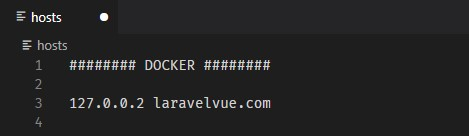

## Guide

Install **[Node](https://nodejs.org/es/)**, **[PHP](https://www.php.net/downloads)**, **[Composer](https://getcomposer.org/)** and **[Docker Desktop](https://docker.com/products/docker-desktop/).**

We use **[Laradock](https://laradock.io/)** to get a configured Laravel docker.

Launch in CMD

    cd laravel-vue
    git clone https://github.com/Laradock/laradock.git

In *laradock* folder we must to copy-paste *env.example*  and new file name as *.env*. In this file we must to set database connections, *APP_CODE_PATH_HOST* and *DOCKER_HOST_IP* variable. 

> DOCKER_HOST_IP=127.0.0.1

When we finish all configuration we can access to **Laravel** with this IP (or *localhost*).

> APP_CODE_PATH_HOST=../laravelVue

Docker get this path project.

Search *MYSQL_VERSION* in *.env* file and set all variables like like this.

    MYSQL_VERSION=latest
    MYSQL_DATABASE=laravelvue
    MYSQL_USER=default
    MYSQL_PASSWORD=secret
    MYSQL_PORT=3306
    MYSQL_ROOT_PASSWORD=root
    MYSQL_ENTRYPOINT_INITDB=./mysql/docker-entrypoint-initdb.d

Also, in *laradock/mysql/entrypoint.init.d* we can copy-paste *createdb.sql.example* file and name as *createdb.sql*. Inside this file we can put

    CREATE DATABASE IF NOT EXISTS `laravelvue` COLLATE 'utf8_general_ci' ;
    GRANT ALL ON `laravelvue`.* TO 'default'@'%' ;

Open **Docker Desktop**, with CMD launch this commands

    cd laradock
    docker-compose up -d nginx mysql phpmyadmin

In *laravelVue* folder we must to copy-paste *env.example* and name as *.env* In this file we must to set your database and email connections.

Default connection in *.env* file for this project.

    DB_CONNECTION=mysql
    DB_HOST=mysql
    DB_PORT=3306
    DB_DATABASE=laravelvue
    DB_USERNAME=root
    DB_PASSWORD=root

Don´t forget to set **MailTrap** credentials.

With CMD and launch this commands

    cd laravelVue
    composer install
    npm install
    php artisan key:generate

After all we can edit *etc/host* file to use a domain name.

### Frontend
- [Vue (JS)](https://vuejs.org/).
    - Added packages
        - [SweetAlert2 for Vue](https://www.npmjs.com/package/vue-sweetalert2).
        - [Vue Select](https://vue-select.org/).
- [Tailwind (CSS)](https://tailwindcss.com/). 
- [Font Awesome](https://www.npmjs.com/package/@fortawesome/fontawesome-free).

    To compile CSS (with [PostCSS](https://postcss.org/)) and JS for environments launch this command 

      npm run dev 

    or 
      
      npm run prod 

    We can use this command to compile all changes in *real time* for development.

      npm run watch

### Backend
- [Laravel (PHP)](https://laravel.com/).
    - Added packages
        - [Laravel Collective HTML](https://laravelcollective.com/docs/6.x/html)
        - [Laraveles Spanish](https://github.com/Laraveles/spanish)
        - [Pelmered Fake Car](https://github.com/pelmered/fake-car)
        - [Barryvdh Debugbar](https://github.com/barryvdh/laravel-debugbar)
    - Check if *laravelvue* database is created. Else create it. **PHPMyAdmin** docker is in http://localhost:8081
    - Launch

          php artisan migrate:fresh --seed  
      
        If return a error when launch migrations change *mysql* to *localhost* in *laravelVue* .env file. With laradock some scripts must be to launch in workspace container, if we prefer we can use this little trick to launch it from outside of docker. Then return file to original state.

    - Default credentials if we need to enter in **PHPMyadmin** 

          Server: mysql 
          User: root
          Password: root

### Other Tools

- [Postman](https://www.postman.com/).
    - Check in *postman* folder *environments.json*. There are some environments values. Change *url_base* or *url_domain* value if it necessary. There are the *laravelVue* IP and domain (if we configure it in etc/host).
    - Launch this command

           npm install newman
           npm install newman-reporter-htmlextra
           cd postman
           newman run collection.json -e environments.json -r cli htmlextra

         If return a error when launch last command change *mysql* to *localhost* in *laravelVue .env* file. With Laradock in some cases we can't access to dockers resources, if we prefer we can use this little trick. Then return file to original state.

## Other considerations

### Email

- A email system (with **[MailTrap](https://mailtrap.io/)**) send email when car is deleted from datatable. Email is sent to all user related to this car.

  A user can drive one car, a car could driven by one user.

  

### Credentials

- Admin user

    - Name: **Admin**
    - Password: **test** 

- Reviewer user

    - Name: **Reviewer**
    - Passwod: **test**

### Vue and Blade

- To avoid excessive complexity we use Vue only in the forms and tables views.

### Database

