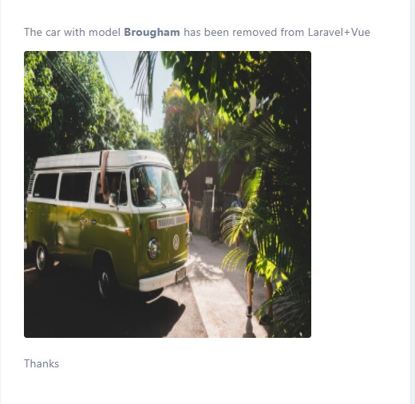
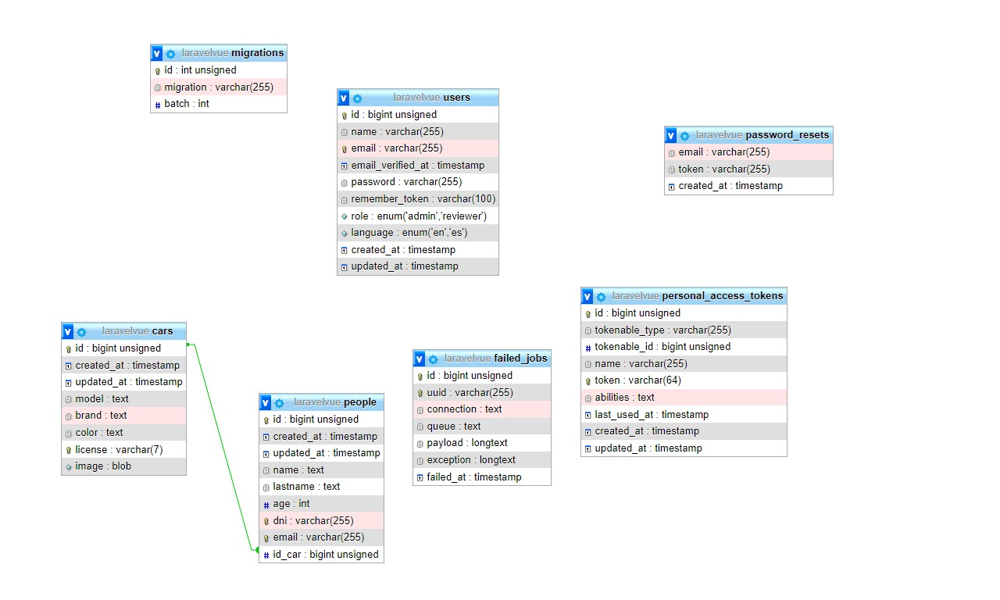

## Guide

Install **[Node](https://nodejs.org/es/)**, **[Composer](https://getcomposer.org/)** and **[Docker Compose](https://docs.docker.com/compose/install/).**

In *laravelvue* folder rename *env.example* file to *.env* and edit this file to set your database and email connections.

Launch this command

    php artisan key:generate

docker-compose up -d nginx mysql phpmyadmin

### Frontend
- [Vue (JS)](https://vuejs.org/).
    - Added this packages
        - [SweetAlert2 for Vue](https://www.npmjs.com/package/vue-sweetalert2).
        - [Vue Select](https://vue-select.org/).
- [Tailwind (CSS)](https://tailwindcss.com/). 
- [Font Awesome](https://www.npmjs.com/package/@fortawesome/fontawesome-free).

    To compile CSS (with [PostCSS](https://postcss.org/)) and JS launch this command 

      npm run dev | npm run prod 

### Backend
- [Laravel (PHP)](https://laravel.com/).
    - Added this packages
        - [Laravel Collective HTML](https://laravelcollective.com/docs/6.x/html)
        - [Laraveles Spanish](https://github.com/Laraveles/spanish)
        - [Pelmered Fake Car](https://github.com/pelmered/fake-car)
        - [Barryvdh Debugbar](https://github.com/barryvdh/laravel-debugbar)
    - Create *laravelvue* database.
    - Check database connection in *.env* file.
    - Launch

            php artisan migrate
            php artisan db:seed

### Other Tools

- [Postman](https://www.postman.com/).
    - Launch this command

          newman run COLLECTION -r -e ENVIRONMENT htmlextra

## Other considerations

### Email

- A email system (with **[MailTrap](https://mailtrap.io/)**) send email when car is deleted from datatable. Email is sent to all user related to this car.

  A user can drive any car, a car could driven by many user, **dni <-> license** relationship.

  

### Credentials

- Admin user

    - Name: **Admin**
    - Password: **test** 

- Reviewer user

    - Name: **Reviewer**
    - Passwod: **test**

### Vue and Blade

- To avoid excessive complexity we use Vue only in the forms and tables views.

### Database

