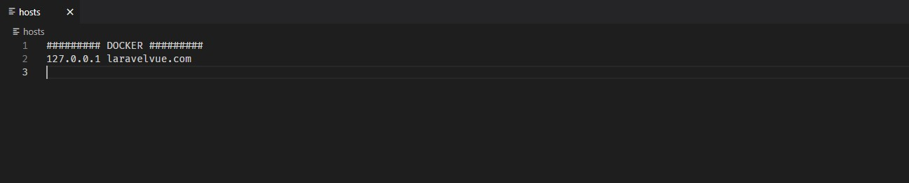

## Guide

Install **[Node](https://nodejs.org/es/)**, **[Composer](https://getcomposer.org/)** and **[Docker Desktop](https://docker.com/products/docker-desktop/).**

We use **[Laradock](https://laradock.io/)** to get a configured Laravel docker.

In *laradock* folder we must to rename *env.example* file to *.env* and edit to set your database connections and *DOCKER_HOST_IP* variable. 

Open Docker Desktop, with CMD go to *laradock* folder and launch this command

    docker-compose up -d nginx mysql phpmyadmin

In *laravelvue* folder we must to rename *env.example* file to *.env* and edit to set your database and email connections.

Default connection variables for this project.

    DB_CONNECTION=mysql
    DB_HOST=mysql
    DB_PORT=3306
    DB_DATABASE=laravelvue
    DB_USERNAME=root
    DB_PASSWORD=root

Go to *laravelvue* folder with CMD and launch this commands

    composer install
    npm install
    php artisan key:generate

After all we can edit *etc/host* file to use a domain name.

### Frontend
- [Vue (JS)](https://vuejs.org/).
    - Added packages
        - [SweetAlert2 for Vue](https://www.npmjs.com/package/vue-sweetalert2).
        - [Vue Select](https://vue-select.org/).
- [Tailwind (CSS)](https://tailwindcss.com/). 
- [Font Awesome](https://www.npmjs.com/package/@fortawesome/fontawesome-free).

    To compile CSS (with [PostCSS](https://postcss.org/)) and JS for environments launch this command 

      npm run dev | npm run prod 

    We can use this command to compile all changes in *real time* for development.

      npm run watch

### Backend
- [Laravel (PHP)](https://laravel.com/).
    - Added packages
        - [Laravel Collective HTML](https://laravelcollective.com/docs/6.x/html)
        - [Laraveles Spanish](https://github.com/Laraveles/spanish)
        - [Pelmered Fake Car](https://github.com/pelmered/fake-car)
        - [Barryvdh Debugbar](https://github.com/barryvdh/laravel-debugbar)
    - Check if *laravelvue* database is created. Else create it. **PHPMyAdmin** docker is in http://localhost:8081
    - Launch

          php artisan migrate:fresh --seed  
      
        If return a error when launch migrations change *mysql* to *localhost* in *laravelvue* .env file. The laradock hosts fails with migration. Then return file to original state.

    - Default credentials for PHPMyAdmin 

          Server: mysql 
          User: root
          Password: root

### Other Tools

- [Postman](https://www.postman.com/).
    - Check in *postman* folder *environments.json*. There are some environments values. Change *url_base* or *url_domain* value if it necessary. There are the *laravelVue* IP and domain (if we configure it in etc/host).
    - Launch this command

           npm install newman
           npm install newman-reporter-htmlextra
           cd postman
           newman run collection.json -e environments.json -r cli htmlextra

## Other considerations

### Email

- A email system (with **[MailTrap](https://mailtrap.io/)**) send email when car is deleted from datatable. Email is sent to all user related to this car.

  A user can drive one car, a car could driven by one user.

  

### Credentials

- Admin user

    - Name: **Admin**
    - Password: **test** 

- Reviewer user

    - Name: **Reviewer**
    - Passwod: **test**

### Vue and Blade

- To avoid excessive complexity we use Vue only in the forms and tables views.

### Database

